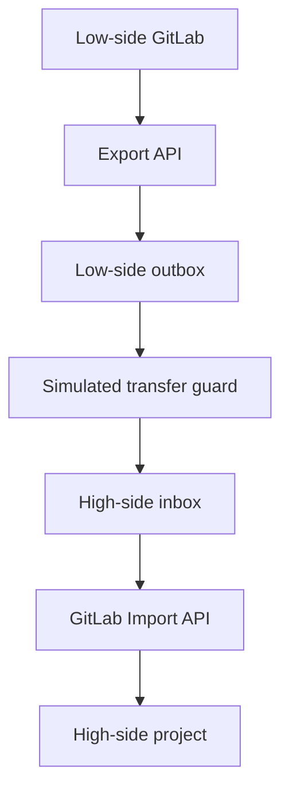

POC - demonstrates workflow without representing itself as an approved cross-domain solution.

### What the implementation does

The bundle contains:

| File                      | Purpose                                                                                                                       |
| ------------------------- | ----------------------------------------------------------------------------------------------------------------------------- |
| `export_project.sh`       | Starts a GitLab project export, polls its status, downloads the `.tar.gz`, and generates a SHA-256 digest.                    |
| `transfer_guard.py`       | Emulates a restrictive transfer boundary by checking the digest, size, archive paths, links, file types, and expansion ratio. |
| `import_project.sh`       | Submits the approved archive to the high-side GitLab import API and monitors completion.                                      |
| `low-side.gitlab-ci.yml`  | Example low-side validation and export pipeline.                                                                              |
| `high-side.gitlab-ci.yml` | Example high-side intake and manual import pipeline.                                                                          |
| `test_transfer_guard.py`  | Tests successful transfer and rejection of archive path traversal.                                                            |
| `README.md`               | Setup instructions and production considerations.                                                                             |

The tests pass using Python’s built-in test runner, and both shell scripts pass syntax validation.

GitLab officially supports asynchronous project export, status checks, export download, archive upload, and import-status checks through its API. It can also import directly from S3 in some configurations. [GitLab project import/export API](https://docs.gitlab.com/api/project_import_export/)

For multiple related projects, the same design can be extended using GitLab’s group export/import API, which preserves group structure and some relationships between group and project resources. [GitLab group import/export API](https://docs.gitlab.com/api/group_import_export/)

### Important limitation

`transfer_guard.py` is only a test double. It lets you develop the automation and integration points without access to classified infrastructure, but it does not provide:

* An authorized path between security domains
* Hardware-enforced directionality
* NCDSMO assessment or inclusion on an approved baseline
* Classification or releasability determination
* Production malware scanning or content-disarm-and-reconstruction
* Independent, non-bypassable policy engines
* A site-specific authorization or ATO

S3, MinIO, NFS, removable media, `rsync`, or an API gateway can provide staging or transport, but none becomes a CDS merely by separating the endpoints.

## Alternatives to AWS Diode

### 1. Everfox High Speed Guard

The closest general-purpose guard alternative for high-throughput, automated transfers.

* Supports bidirectional and multidomain transfers.
* Handles structured data, streaming traffic, and bulk files.
* Provides filtering, sanitization, policy enforcement, and auditing.
* Everfox states that High Speed Guard is on the NCDSMO Baseline and designed for Raise-the-Bar requirements. [Everfox High Speed Guard](https://www.everfox.com/products/cross-domain-solutions/high-speed-guard/)

This could consume the low-side export from a controlled directory or storage endpoint and deliver it to the high-side intake location.

### 2. Everfox Trusted Gateway System

Potentially better when `.tgz` packages contain complicated combinations of JSON, binaries, attachments, and other unstructured files.

Everfox positions Trusted Gateway System for deeper inspection and sanitization of complex files, while High Speed Guard is oriented more toward high-throughput structured or streaming transfers. [Everfox Trusted Gateway System](https://www.everfox.com/products/cross-domain-solutions/trusted-gateway-system/)

This distinction matters for GitLab exports because the archive may contain:

* JSON metadata
* Git repository bundles
* Uploaded files
* CI/CD definitions
* Issues, comments, and merge-request data
* Potentially active or malicious content

### 3. Everfox Data Guard

A flexible guard supporting both unidirectional and bidirectional transfers with granular rules and byte-level inspection. It may be appropriate when the transfer policy must understand several file formats rather than simply pass an opaque archive. [Everfox Data Guard](https://www.everfox.com/products/cross-domain-solutions/data-guard/)

### 4. Owl Cyber Defense data diodes

A strong option where the primary requirement is hardware-enforced one-way movement.

* Physically enforces transfer direction.
* Offers protocol-aware filtering products.
* Suited to high-assurance low-to-high flows where no network return channel should exist.
* Owl describes its products as government-evaluated and designed around Raise-the-Bar and Zero Trust guidance. [Owl data-diode products](https://owlcyberdefense.com/products/data-diode-products/)

The tradeoff is orchestration complexity: GitLab’s normal API interaction expects request/response behavior. With a true one-way diode, the low side generally deposits a self-contained package, and the high side independently discovers and processes it. Import results cannot simply travel back over the same path.

### 5. Existing enterprise or program CDS

In practice, the best alternative may be a CDS already authorized and operated by the agency, combatant command, hosting enclave, or enterprise service provider. Examples could include a managed guard, approved file-transfer service, or removable-media workflow.

This is often preferable because CDS acceptance is not solely a product-selection decision. The NSA’s NCDSMO Raise-the-Bar strategy covers CDS design, development, assessment, implementation, and operation. A commercially available product still requires configuration review and authorization for the specific mission and domains. [NSA NCDSMO and Raise the Bar](https://www.nsa.gov/Cybersecurity/Partnership/National-Cross-Domain-Strategy-Management-Office/)

## Recommended production pattern

For a `.tgz` package containing JSON, project bundles, binary data, and clear text, structure the integration as follows:

1. Export from GitLab on the low side.
2. Generate a manifest listing every internal file, size, type, and SHA-256 digest.
3. Sign the manifest using a low-side signing identity.
4. Scan individual content before packaging where possible.
5. Submit the package and manifest to the approved CDS ingress.
6. Have the CDS validate the archive structure, permitted formats, malware results, classification rules, and signature.
7. Deliver it to a write-only high-side intake area.
8. Independently verify the signature and hashes on the high side.
9. Quarantine and review the imported `.gitlab-ci.yml` before permitting pipelines to execute.
10. Import into a staging namespace—not directly into the operational high-side project.
11. Run high-side security testing and obtain an approval before promoting or deploying.
12. Reconcile transfers through audit records without creating an unauthorized reverse path.

The imported pipeline deserves special attention: GitLab warns that importing projects from untrusted sources can expose CI/CD variables through malicious pipeline configuration. High-side runners should therefore remain disabled or isolated until the imported configuration is reviewed. [GitLab import/export security settings](https://docs.gitlab.com/administration/settings/import_and_export_settings/)
